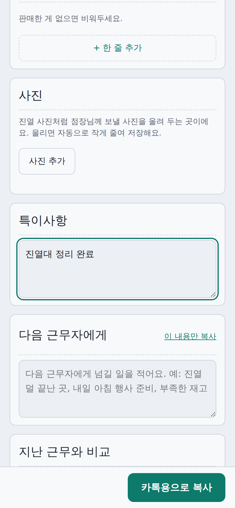
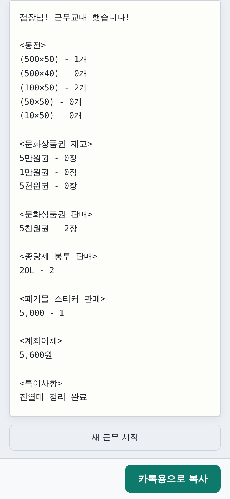
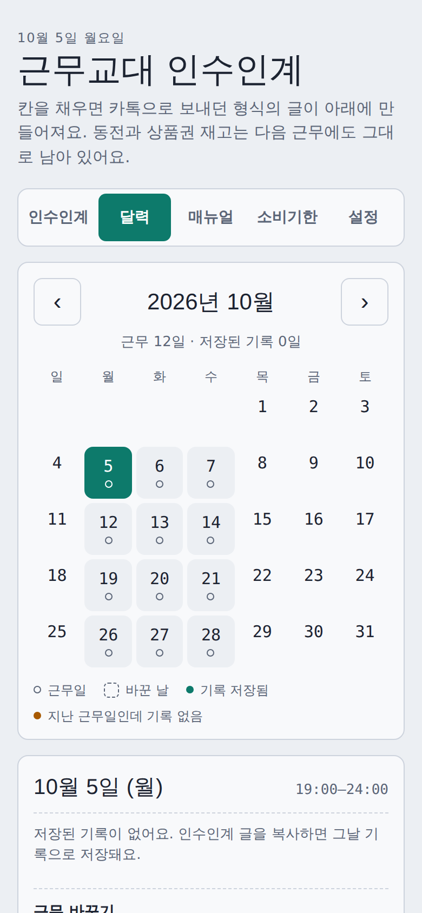
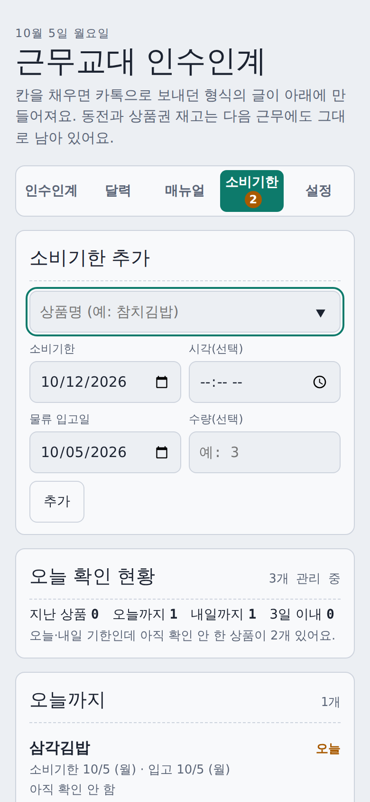

# 근무 인수인계 웹앱

편의점 근무 교대 때마다 카카오톡으로 보내던 인수인계 보고를, 칸만 채우면 같은 형식의 글로 만들어 주는 모바일 웹 페이지예요.

**바로 써 보기:** https://yeonisland.github.io/portfolio/handover/

| 입력 화면 | 만들어진 카톡용 글 |
| :---: | :---: |
|  |  |

| 근무 달력 | 소비기한 관리 |
| :---: | :---: |
|  |  |

## 왜 만들었나
교대할 때마다 동전 개수, 상품권 재고, 판매 내역을 카톡에 일일이 손으로 써서 보내는 게 번거롭고, 대화방 용량도 쌓였어요. 그래서 쓰던 보고 양식은 그대로 두고 입력과 기록만 자동으로 해 주는 도구를 만들었어요.

## 기능
**인수인계**
- 동전, 문화상품권 재고와 판매, 종량제 봉투, 폐기물 스티커, 담배, 계좌이체, 부분환불, 특이사항을 칸으로 입력
- 버튼 한 번으로 카톡용 글 복사, 비어 있는 항목을 "없음"으로 표시하는 옵션
- 시간대별 할 일 체크(소비기한 확인, 의자 정리 등)와 저온 물류 도착 시각 기록
- 지금 근무의 남은 시간과 번 돈 실시간 표시
- 점장님 전달 사항(고정 가능), 지난 근무와 재고 비교, 다음 근무자에게 남기는 글
- 진열 사진 올리기(자동으로 줄여 저장, 공유 버튼으로 전송)

**달력**
- 날짜별 기록 저장, 대타·휴무 등 근무 변경
- 시급 기준 월 근무시간·급여 계산, 월말 근무시간 보고 글 자동 작성
- 저온 물류 도착 시각 평균(요일별)

**소비기한 · 매뉴얼 · 설정**
- 상품·소비기한·입고일 기록, 오늘/내일/3일 이내/폐기 대상 분류, 확인 기록과 확인 시간 알림
- 자주 쓰는 업무 방법을 적어 두는 매뉴얼
- 정기 근무 요일·시간, 항목 켜고 끄기, 종량제·스티커 규격 수정, 직접 만드는 항목

## 퍼블리싱 포인트
- **모바일 우선 레이아웃**: 폰 한 손 사용을 기준으로 잡았고, 버튼과 입력칸의 터치 영역을 44px 이상으로 맞췄어요. 좁은 화면에서도 가로 스크롤이 생기지 않아요.
- **디자인 토큰**: 색, 글꼴을 CSS 변수(`:root`)로 정의하고, `prefers-color-scheme`으로 라이트·다크 모드를 처리해요.
- **접근성**: 시맨틱 마크업(`main`, `header`, `nav`, `section`), 탭에 `role="tablist"`, 버튼과 입력칸에 `aria-label`, 상태 안내에 `aria-live`를 썼어요.
- **크로스 브라우저**: 크롬(자동 테스트)과 삼성 인터넷(직접 사용)에서 확인했어요.
- **구조 분리**: 구조(`index.html`), 스타일(`style.css`), 동작(`app.js`)을 나눴어요.

## 설계에서 신경 쓴 점
- **서버 없이 동작**: 로그인과 서버 없이 정적 파일만으로 돌아가요. 기록은 브라우저(localStorage, 사진은 IndexedDB)에만 저장돼요.
- **내 가게에 맞게 바꾸기**: 가게마다 파는 품목이 달라서, 항목을 끄고 규격을 고치고 새 항목을 직접 만들 수 있게 했어요.
- **데이터 백업**: 서버가 없어서 사라질 수 있는 기록을 위해 JSON 백업·복원을 넣었어요.
- **자정을 넘는 근무**: 새벽 5시 전은 전날 근무로 계산해서, 24시 퇴근과 자정 이후 입력도 한 근무로 묶여요.
- **개인정보 최소화**: 이름과 근무번호 기본값은 비워 두고, 월말 보고 때만 직접 입력해요.

## 파일 구성
```
handover/
├─ index.html    마크업(구조)
├─ style.css     디자인 토큰, 레이아웃, 다크 모드
├─ app.js        입력·저장·달력·소비기한·사진 동작
├─ screenshots/  README용 화면 사진
└─ README.md
```

## 기술
HTML, CSS, JavaScript(프레임워크·외부 라이브러리 없음, `let`/`const` 사용). 글꼴만 Google Fonts에서 불러와요. GitHub Pages로 배포해요.

## 사용 시 알아 둘 점
- 기기나 브라우저를 바꾸면 기록이 비어 있어요. 달력 탭 맨 아래 "기록·설정 백업"을 복사해 두었다가 복원하세요. 사진은 백업에 들어가지 않아요.
- 알림은 페이지를 열어 둔 상태에서만 동작해요.
